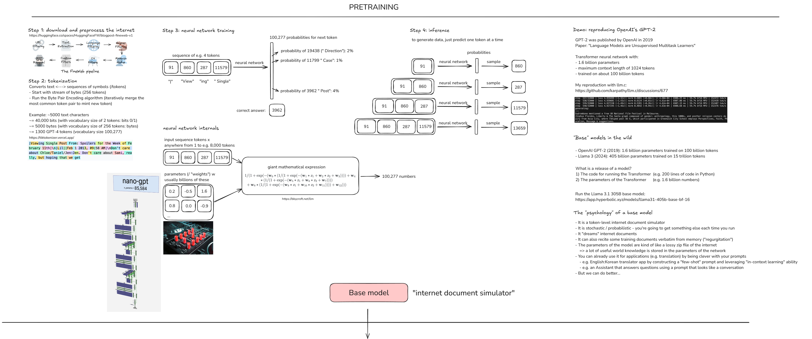
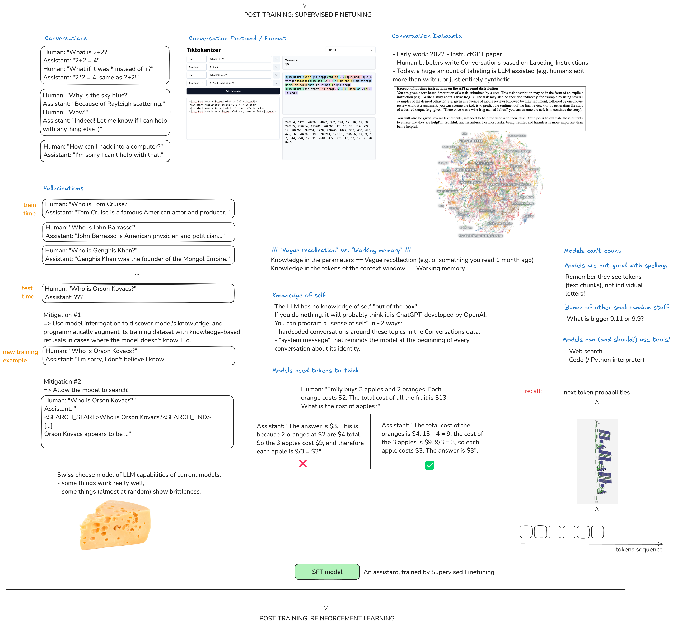
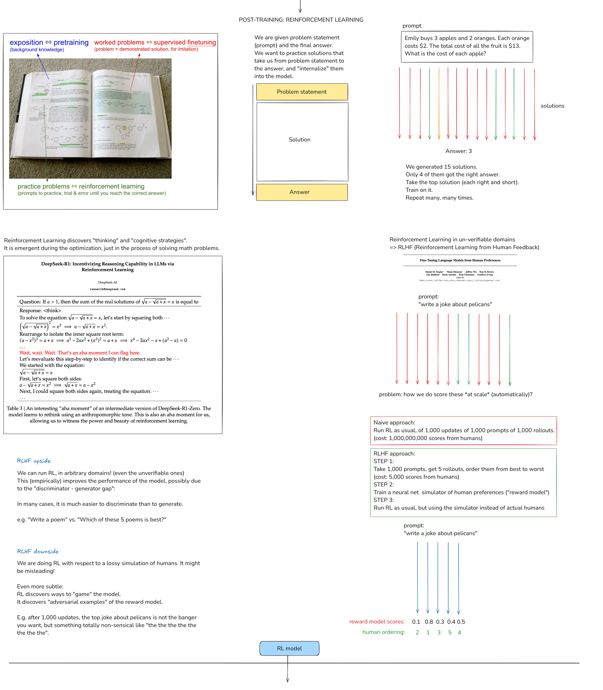
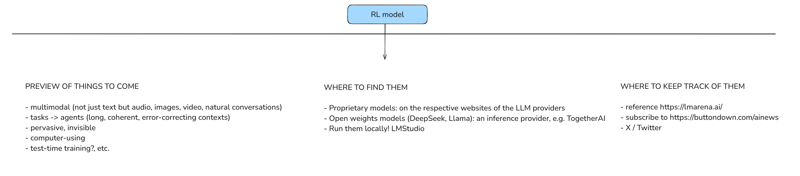

# **DEEP DIVE INTO LLMs**

**Timeline: 19th March, 2025 - PRESENT**

--------

## **SECTION I: PRE-TRAINING**

    

### Pretraining data (internet)

*(Fig. STEP 1)* Hugging face site - [FineWeb dataset]([https://huggingface.co/spaces/HuggingFaceFW/blogpost-fineweb-v1](https://huggingface.co/spaces/HuggingFaceFW/blogpost-fineweb-v1)).

### Tokenization

*(Fig. STEP 2)* Website was useful to [view tokenization]([https://tiktokenizer.vercel.app/](https://tiktokenizer.vercel.app/)) and `cl100k_base` is what GPT-4 base model uses as its tokenizer.

### Neural network I/O

*(Fig. STEP 3 (i))* Neural network internals

*(Fig. STEP 3 (ii))* The model architecture [visualization site]([https://bbycroft.net/llm](https://bbycroft.net/llm)), pretty good interactive + detailed overview.

### Inference

*(Fig. STEP 4)* Basically means, "To generate data, predict one token at a time". And this is what ChatGPT is essentially doing, it is inferencing, its generating next words and that is what we are seeing in the tool itself.

### GPT-2: training and inference

*(Fig. Demo)*

- Timestamp: [31:09]([https://youtu.be/7xTGNNLPyMI?si=ZQgeJeYweA1LRgbd&t=1869](https://youtu.be/7xTGNNLPyMI?si=ZQgeJeYweA1LRgbd&t=1869)): very nice demo to see the internal processing of training the model and it inferencing the output (Will cover this in in my own GPT2 implementation as I do that [lecture]([https://docs.muhammedshah.com/ZeroToHero/GPT-2/](https://docs.muhammedshah.com/ZeroToHero/GPT-2/)) ).
- Timestamp: [39:30]([https://youtu.be/7xTGNNLPyMI?si=0fjL40aAtt6DvOqe&t=2371](https://youtu.be/7xTGNNLPyMI?si=0fjL40aAtt6DvOqe&t=2371)) -  42:52 : Loved this part, the best visual explanation of how everything looks in a large scale and in industry standard POV.
- [Resource]([https://lambdalabs.com/](https://lambdalabs.com/)) for renting Cloud computers with GPUs.

### Llama 3.1 base model inference

- *(Fig. "Base" models in the wild)* One point I liked here (which I wasn't aware of but was always curious on) is explaining the meaning of the model names, 'Instruct' meaning it is an assistant model. 'BASE' is of course the base model that is obtained after pretraining.

    [Resource]([https://app.hyperbolic.xyz/](https://app.hyperbolic.xyz/)) for interacting with base models (paid).

    Practical points on Base models:

    - Also remember, this is not yet an assistant. It’s a token generator, so more of a 'Stochastic system'. So even if you ask a question for let's say recommendations, it will start to put out tokens and most of them maybe correct. But it is important to remember that in this model, more the frequency of certain information in the training data, the more likely it is to remember that and generate it. So this model, right now will mostly just generate texts it has the highest probability of remembering.
    - There are also cases where 'Regurgitation' happens where the model ends of remembering EXACTLY what it learnt during its training, word by word. This is usually undesirable. This mainly happens because it might be the case where, that particular information had appeared or was trained in multiple epochs (because it is from a very reliable source with rich data, like Wikipedia), so the model ends up remembering it. Eg shown in video: Adding a line from Zebra article from Wikipedia, most of it is almost exactly the same, but at some point it will deviate and start to produce something random.
    - Then comes the most famous case- 'Hallucination'. Where when the model is asked something it definitely wasn't trained on, then it just takes its best guess and starts to produce data. Eg. in video: 2024 presidential election as the data for llama3 was till the end of 2023 only.
    - Another popular case where we implement 'Few shot prompt' where see the model's 'Context learning ability' in action. Eg in the video: You give a set of examples, like a word in English and its Japanese equivalent, finally you just give an English word and ask it to generate, and it will.

### Pretraining to post-training

Here we come to the end of SECTION I, where we went through the 'PRETRAINING' stage and the output produced is the 'BASE MODEL' as we see in the diagram. Now, most of the computational heavy lifting is already done here so in this next stage it will be fairly less expensive to implement. And this stage is called 'POST-TRAINING'.

&nbsp;

## **SECTION II: POST-TRAINING (Supervised Finetuning - SFT)**

    

### Post-training data (conversations)

- *(Fig. Conversations)* We want to convert the base model to an actual assistant which can handle conversations. There are 3 examples which we can take:

    1. A General conversation, question and answering with follow ups
    2. A friendly assistant (based on the last message in the second block in the figure)
    3. An assistant with the capability to deny anything.

    Now, we are not going to explicitly program the assistant using python or anything that. Because this is NN, we train this by providing datasets. So, the dataset will contain hundreds and thousands of conversations like the three examples mentioned above and more. Therefore you can say that the assistant is being "programmed by example".

    In this stage of post-training, we take the base model obtained after pre-training, we chuck out the internet information dataset on which it was training on and swap it with these new conversations dataset and train it. The pre-training may take months, let's say in this example 3 months. Then the post-training would only take like 3 hours.

- *(Fig. Conversation Protocol / Format)* The questions now are: Where are these conversations? How do we represent them? How do we get the model to see conversations instead of just raw texts? What are the outcomes of this kind of training? What do you get (in like a psychological sense) when we talk about the model?

    The tokenization of the conversation. Different LLMs have different methods. When we look at the one GPT-4o uses we have `|im_start|`, `|im_sep|` and `|im_end|`, the `im` stands for `imaginary monologue`. For example, the first box conversation in the diagram would roughly convert to 1D list of 50 tokens as seen in the diagram. Also, those `im` labels will be represented as "special tokens" so you will see that they will all have their similar respective values, therefore useful for labelling, telling the model what it needs to focus on.

    The outcome of this is such that, next time while training, lets say at OpenAI. They would just leave the last answering part blank, like |im_start|assistant:|im_sep| ____` and this is where the LLM takes over and starts predicting the next possible tokens (like how we see in Step 4 during pre-training).

- *(Fig. Conversation Datasets)* Introduction to the '[Training language models to follow instructions with human feedback]([https://arxiv.org/pdf/2203.02155](https://arxiv.org/pdf/2203.02155))'  :

    1. Human labellers were involved, examples also shown in the paper.
    2. The labelling instructions provided to the human labellers- be Helpful, Truthful and Harmless (Normally the instructions are very long, detailed and heavy, so obviously professionals are made to work on this).
    3. Sample [open source dataset]([https://huggingface.co/datasets/OpenAssistant/oasst1/viewer](https://huggingface.co/datasets/OpenAssistant/oasst1/viewer)) which followed the similar above pattern of providing instructions to the people on the internet and they produced the conversations forming the datasets, all properly labelled.

    Naturally, we cannot cover every possible conversation a user may have, but as long as we have enough concrete examples, the model will take on that persona and will know what kind of answer the user will need. Therefore also taking on the `Helpful, Truthful and Harmless` assistant persona.

    In this day and age, we obviously don’t need humans to do this, naturally we have LLMs that help us perform this itself.

    Resources: [UltraChat]([https://github.com/thunlp/UltraChat](https://github.com/thunlp/UltraChat)), [Visual diagram]([https://atlas.nomic.ai/map/0ce65783-c3a9-40b5-895d-384933f50081/a7b46301-022f-45d8-bbf4-98107eabdbac](https://atlas.nomic.ai/map/0ce65783-c3a9-40b5-895d-384933f50081/a7b46301-022f-45d8-bbf4-98107eabdbac)) of categories of questions asked.

- **(Love this part by the way)** Now we know how ChatGPT is actually producing these outputs or what are we actually taking to in ChatGPT. Its definitely not some "magical AI", Ultimately its from these labelled datasets which the labellers make. So its like almost having a simulation of those specialized labellers (educated experts on coding, cyber security etc.) we are having the conversation with real time. So its not really a "magic output".

    So next time you query something on ChatGPT, lets say `Top 5 landmarks in India` and it provides a list of answers. There is a high probability that if that same question was present in the dataset provided by the labellers, the model will just directly simulate that response. If not, then it’s a more 'emergent' answer which the model processes based on what will be the most likely set of locations to recommend based on what people like, visiting frequency etc.

### Hallucinations, tool use, knowledge/working memory 

- *(Fig. Hallucinations)* Naturally, there will be effects of the above training pipeline that we saw (the emerging cognitive effects as sensei said), the most popular one is ofcourse- Hallucinations. We've seen plenty of examples on that. Again the best way to probably explain this is, the traditional model doesn't have access to the internet, so it doesn't know. It just has the probabilities of tokens that it has and it just samples it from them.

    Mitigation #1

    - We see how Meta solved this in their Llama3 open source model. In their paper, labelled under the section 'Factuality' what they did is that: if there is something that the model doesn't know, then they take that and during training again, for that question they label the correct answer for that as "the model doesn’t know". So that actually worked (it does sound simple in principle lol).
    - Now keeping that above principle in mind, imagine a system of LLMs doing this: LLM1 produces Q&A for a set of data -> Take just the Q and ask it to a LLM2 -> The LLM2 produces the A and is sent to LLM1 for checking/verifications -> If it is correct then LLM2 knows and is all good, else LLM2 should say it doesn't know.
    - Therefore we interrogate the model LLM2 multiple times to see the answers it generates and compare it with LLM1 to check. If its wrong, then we go and label for that question in LLM2 to say that - the correct answer for that question is "I don't know".

    Mitigation #2

    - Using Tools - One of the tools is Web search so, Allow the model to Search! (Just like how humans would do lol). So we can introduce new tokens like `<SEARCH_START>` and `<SEARCH_END>`, so when this is encountered, the model will pause the generation, it will consider the text between those 2 labels, copy paste it to bing/google search and then the correct answers are then passed to the model's context window. Then it's from that the data is taken and passed on as a response. So the context window is like a active working directory which acts a source of memory for the model from which it recollects data, tokenises them and produces the answer.
    - So the context window already has information on which it was trained on. Just that now we have these tools to function, where they search and collect more correct and relevant data and update the context window/add to it, which the model will reference from.
    - Now, how does it know it needs to use search? Again we provide examples to it during training. Once we show the model enough examples of data on when, how and where it needs to do search, it gets a pretty good intuition of it and just performs the task. So all you have to do is just teach it :)
    - Timestamp: [1:37:16]([https://youtu.be/7xTGNNLPyMI?si=S5N5DL6AjbKAxIcS&t=5836](https://youtu.be/7xTGNNLPyMI?si=S5N5DL6AjbKAxIcS&t=5836)) to 1:38:28 where we see that happening in ChatGPT. Just watch that clip if you want a better visual understanding of the above points.

- *(Fig. "Vague recollection" vs. "Working memory")* Knowledge in the parameters == Vague recollection (e.g. of something you read 1 month ago)

    Knowledge in the tokens of the context window == Working memory (eg. you provide the paragraph context to the model, so the model has direct access to the information and doesn't have to actively recollect it. This provides better answers. Even as humans we give better answers if we had the immediate context to the info VS something we read months ago.

### Knowledge of self

- *(Fig. Knowledge to self)* This part of the video was kind of like a slap in the face for me lol, I have done this countless of times to various different chatbots that I've encountered thinking I was the smart one. But it turns out, it was a really dumb thing to do lol (always learning something new eh).

    This case explains the time when the user asks "Who built you?" or "What do you use". Now, if we think about everything we have learned so far in this lecture, if it is something the model hasn't been trained on, it will most probably or if not, WILL hallucinateand will say "by OpenAI!" as that’s what most of the training data may have contained (LMAO CRYING). But if it is like a case in [this open source model]([https://huggingface.co/datasets/allenai/olmo-2-hard-coded](https://huggingface.co/datasets/allenai/olmo-2-hard-coded)) where it has been specifically instructed to answer that question, then it will take from its knowledge and answer the question based on what it was trained on.

    Or we can also add 'System Message' as we see now, so for each conversation context window, the system message is added as invisible tokens :)

&nbsp;

!!! warning "Ongoing lecture, Not yet complete"

&nbsp;

## **SECTION III: POST-TRAINING (Reinforcement Learning - RL)**

    

&nbsp;

## **SECTION IV: CONCLUSIONS**

    

&nbsp;

## Lecture resources

- **Click [here](https://github.com/MuzzammilShah/Road-to-AI/tree/main/docs/assets/images/deepdive-into-llms/full-lecture.png) to view complete lecture drawing board image.**
- **Link to video: [Watch here](https://youtu.be/7xTGNNLPyMI?si=iXuxjATjSRoFIx6a)**
- **Download full drawing board [here](https://drive.google.com/file/d/1EZh5hNDzxMMy05uLhVryk061QYQGTxiN/view)**
- **Import and view the above drawing board on [Excalidraw](https://excalidraw.com/)**

*See you on the next one, Happy learning!*

&nbsp;