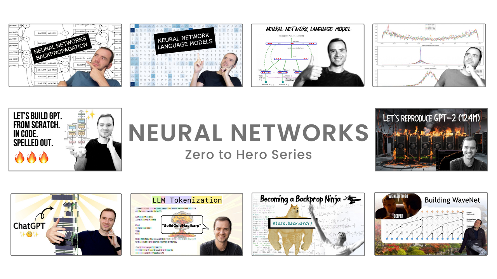

## Introduction
This repository serves as a structured documentation hub for my journey in understanding and implementing artificial intelligence and machine learning concepts, with a primary focus on building a GPT model. The content is heavily based on [Andrej Karpathy](https://karpathy.ai)'s Neural Networks: Zero to Hero series and aims to provide well-organized insights, implementations, and notes for anyone following a similar path.

This site is designed for:

- Learners and developers interested in AI and deep learning.

- Anyone following Karpathy's Zero to Hero series.

- The open-source community looking for structured references and implementations.

&nbsp;

    

&nbsp;

## Documentation structure
The learning resources are divided into three primary sections: **Language Models**, **Transformer Models** and **General MISC**.

**I. Language Modeling Framework**

|Topic | Implementation of | Lecture Link | Documentation Status |
|------|--------|------|------|
|Backpropagation|Micrograd|[Read notes](Micrograd/index.md)| :material-progress-check: Done | :material-progress-check: Done |
|Language Model-1|Makemore (Part 1)|[Read notes](Makemore-part1/index.md)| :material-progress-check: Done | 
|Language Model-2|Makemore (Part 2)|[Read notes](Makemore-part2/index.md)| :material-progress-check: Done | 
|Language Model-3|Makemore (Part 3)|[Read notes](Makemore-part3/index.md)| :material-progress-check: Done |
|Language Model-4|Makemore (Part 4)|[Read notes](Makemore-part4/index.md)| :material-progress-check: Done |
|Language Model-5|Makemore (Part 5)|[Read notes](Makemore-part5/index.md)| :material-progress-check: Done |

**II. Transformer based Modeling Framework - GPT**

|Topic | Implementation of | Lecture Link | Documentation Status |
|------|--------|------|------|
|Transformer Model-1 (GPT)|Build GPT|[Read notes](GPT-1/index.md)| :material-progress-check: Done |
|Transformer Model-2 (GPT)|Reproducing GPT-2|[Read notes](GPT-2/index.md)| :material-progress-alert: - |
|Tokenizers|Build GPT Tokenizer|[Read notes](GPT-Tokenizer/index.md)| :material-progress-alert: - |

**III. General MISC**

|Topic | Lecture Link | Documentation Status |
|------|--------|------|
|Intro to LLMs|[Read notes](General-MISC/intro-llms.md) | :material-progress-check: Done |
|Deep Dive to LLMs|[Read notes](General-MISC/deepdive-llms.md)| :material-progress-check: Done |
|Using LLMs|[Read notes](General-MISC/using-llms.md)| :material-progress-alert: - |

&nbsp;

## Reflections and Usage Guidelines

!!! note "Note from the author"
    - This repository is a personal knowledge base for revision, experimentation, and sharing insights.

    - If you find it useful, or spot any errors or improvements, feel free to reach out.

    - You are welcome to reference this material for your own learning journey!

!!! warning "Ethical Usage"
    This content is based on open-source educational materials (Thanks to Andrej Karpathy). While you are encouraged to learn from and contribute to this resource, please do not copy or repurpose it for commercial use. Respect the effort behind this work, and let's continue fostering an open and ethical AI learning community!

&nbsp;